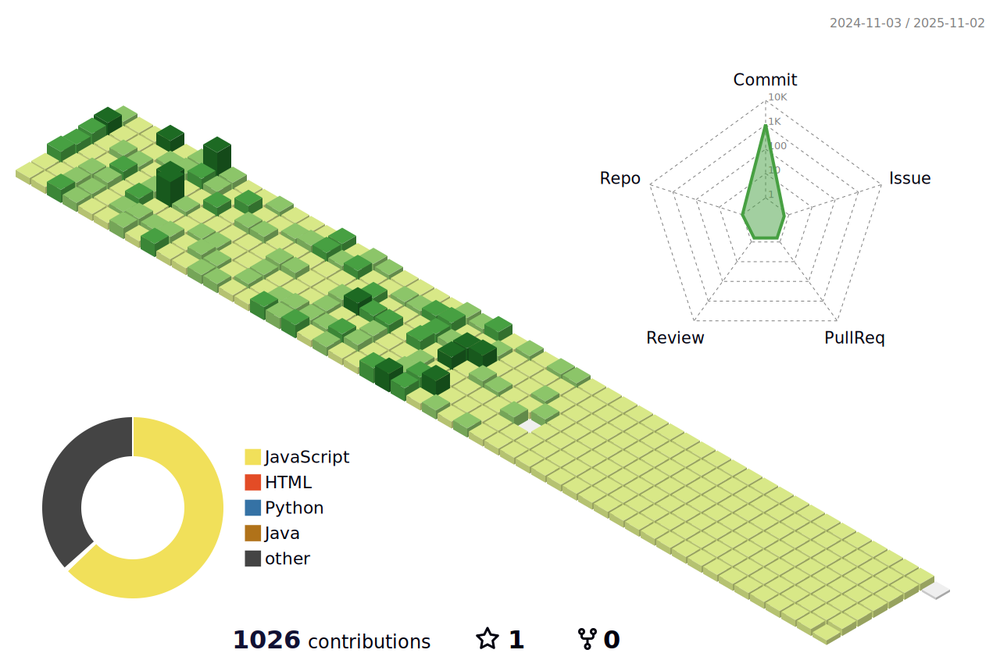

## err-cho404 <a id="Error">

<!--- ### Mini profile --->

Hi, I’m err-cho404

I’m interested in Javascript, Python language

I’m currently learning RPA

 

<!--- ### Main Languages --->

<!--- ### IDEs/Editors --->

<!--- ### Databases --->
<!--- ###  --->

<!--- ### Frameworks, Platforms and Libraries --->

<!--- ### ML/DL --->

<!--- ### 프로필 --->
 

    

<!--- ### 3D잔디 --->

